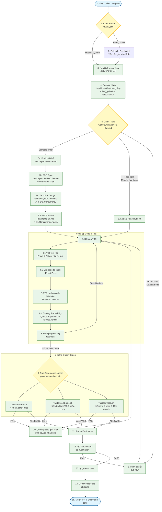

# Framework Kit — AI Agent Integration Guide

Bộ công cụ (Framework Kit) định hướng và kiểm soát chất lượng hoạt động của AI Agent (như Claude Code, Cursor, Windsurf) dựa trên triết lý **Spec-Driven Design (SDD)**, **Quality Gates**, và **Graph-based Orchestration**.

Framework tách biệt tri thức làm 3 trục độc lập để tối ưu hóa Context Budget và ngăn chặn AI ảo tưởng (hallucination):
*   **Rule (WHAT)** — Kiến thức tĩnh (Naming convention, Architecture, Coding style).
*   **Skill (HOW)** — Quy trình thực thi hành động (Checklist, các bước làm TDD, Debugging...).
*   **Workflow (WHEN/NEXT)** — Luồng điều phối các bước đi và xử lý lỗi.

---

## 1. Triết Lý Phân Chia Trách Nhiệm (Core & Extension)

Để đảm bảo bộ kit luôn tinh gọn (lean) và dễ mở rộng sang mọi techstack mà không bị phình to (bloated), framework hoạt động theo mô hình **Core Engine & Architecture Plugins**:

| Kit Cung Cấp (Bắt buộc / Sẵn có) | Dev / Team Tự Viết (Theo dự án & stack) |
| :--- | :--- |
| **Cơ chế Phân giải Động:**<br/>Cú pháp `{stack}` và tự động nạp rules qua `requires_rules` trong Skills. | **Cấu trúc Kiến trúc (`rules/{stack}/architecture.mdc`):**<br/>Quy định layers, DI, naming cụ thể của dự án (ví dụ: Controller $\rightarrow$ Service $\rightarrow$ Repo). |
| **Global Baselines (Chất lượng toàn cục):**<br/>Bảo mật (`security-baseline.mdc`), Traceability (`traceability.mdc`), và SDD Gate (`sdd-gate.mdc`). | **Quy chuẩn Kiểm thử (`rules/{stack}/test-patterns.mdc`):**<br/>Cách cấu hình test runner, mock data, annotations của ngôn ngữ đang dùng. |
| **Quy trình Hành động (Stack-agnostic Skills):**<br/>Quy trình chạy TDD, BDD, Code Review, Debugging,... | **Cấu hình Runtime (`project-context.yaml`):**<br/>Khai báo stack, QC engine, source directories, và file extensions của dự án. |
| **Templates & Format Rules:**<br/>Các file mẫu (`plan-template.md`, `principles-template.md`, `spec-template.md`...) và định dạng quy chuẩn MDC. | **Nguyên tắc Dự án (`docs/principles.md`):**<br/>Các quy định đặc thù (MUST/MUST NOT) riêng biệt của dự án hoặc của doanh nghiệp. |

---

## 2. Sơ Đồ Hoạt Động Tổng Thể (Workflows & Quality Gates)

Dưới đây là sơ đồ tổng thể mô tả cách thức vận hành và sự phối hợp giữa **Developer/Agent**, **Specs**, **Code/Test**, và các **Quality Gates** của framework:



---

## 3. Các Tuyến Phát Triển (Delivery Tracks)

> Chi tiết đầy đủ: [`workflows/canonical-flow.md`](workflows/canonical-flow.md)
> Không chắc đang ở bước nào → gõ **"giờ làm gì?"** để gọi skill `next-step`.

---

### A. Standard Track — Feature mới / thay đổi logic nghiệp vụ

**Khi nào dùng:** Tính năng mới, thay đổi API/DB, logic quan trọng.

**Flow:**
```
product-discovery → brainstorming → spec-driven-development
  → bdd-specification → tech-docs → writing-plans
  → (tdd → progress-logging) × n
  → code-review → qc-automation → trace-validation → shipping
```

**Cách gọi từng bước qua chat:**

| Bước | Nói với agent |
|------|--------------|
| Khám phá yêu cầu | `"khám phá yêu cầu"` hoặc `"product discovery"` |
| Viết Product Brief | `"viết Product Brief cho <tính năng>"` |
| Viết BDD spec | `"viết BDD spec cho <UC-ID>"` |
| Thiết kế kỹ thuật | `"tech design cho <UC-ID>"` |
| Lập kế hoạch task | `"lập kế hoạch"` hoặc `"writing plans"` |
| Implement (TDD) | `"bắt đầu TDD task <n>"` |
| Review code | `"review code"` |
| Chạy QC | `"qc automation"` |
| Validate trace | `"validate trace"` |
| Deploy | `"ship"` hoặc `"deploy checklist"` |

**Gate bắt buộc trước merge:**
```bash
bash scripts/governance-check.sh
```

---

### B. Fast Track — Thay đổi nhỏ, rủi ro thấp (< 30 phút)

**Khi nào dùng:** Sửa UI copy, config, typo, style — không đổi logic nghiệp vụ.

**Flow:**
```
brainstorming (rút gọn) → writing-plans → tdd → code-review → trace-validation → shipping
```

**Cách kích hoạt:** Thêm tag `[fast-track]` vào commit message hoặc PR title — SDD gate tự động bỏ qua.

```bash
git commit -m "fix: update button label [fast-track]"
```

**Gọi qua chat:** Nói thẳng việc cần làm, agent sẽ bỏ qua spec pipeline:
```
"fix nhanh: đổi label nút Submit thành Lưu [fast-track]"
```

---

### C. Hotfix Track — Sự cố production khẩn cấp

**Khi nào dùng:** Bug production, downtime, data sai — cần fix ngay.

**Flow:**
```
bug-flow (triage) → debugging / root-cause-tracing
  → tdd (repro test & sửa lỗi) → code-review → qc (focused) → shipping
```

**Cách kích hoạt:** Thêm tag `[hotfix]` — toàn bộ discovery pipeline bỏ qua.

```bash
git commit -m "fix: resolve null pointer in payment service [hotfix]"
```

**Gọi qua chat:**
```
"bug production: <mô tả triệu chứng> [hotfix]"
"phân tích log: <paste log> [hotfix]"
```

> **Lưu ý:** Hotfix vẫn bắt buộc viết repro test FAIL trước khi sửa (Prove-It Pattern) và chạy `governance-check.sh` trước khi merge.

---

## 4. Các Vai Trò & Personas Của Agent (`agents/`)

Bộ kit thiết kế sẵn các Agent Persona chuyên biệt để phân rã và kiểm định chất lượng chéo (Cross-verification):

1.  **Developer (`developer.md`):** Hiện thực hóa feature từ spec — lập kế hoạch, parallel execution, TDD, gắn @trace tags, cập nhật `dev_selftest`.
2.  **Debugger (`debugger.md`):** Phân tích log, trace call stack qua nhiều layer, xác định root cause và sửa lỗi theo Prove-It Pattern.
3.  **Code Reviewer (`code-reviewer.md`):** Kiểm tra mã nguồn trên 5 trục chất lượng (Kiến trúc, Hiệu năng, Bảo mật, Khả năng test, và Naming). Đóng vai trò kiểm duyệt trước khi merge.
4.  **Tester (`tester.md`):** Đọc BDD spec, lên kịch bản test suite động, kiểm tra các trường hợp biên và Edge cases.
5.  **Test Engineer (`test-engineer.md`):** Chuyên thiết kế cấu trúc test suite tự động, phân tích khoảng trống độ phủ test (Coverage Gap Analysis).
6.  **Security Auditor (`security-auditor.md`):** Rà soát bảo mật tĩnh, Threat Modeling, quét OWASP Top 10 và các rò rỉ secret key.
7.  **Web Performance Auditor (`web-performance-auditor.md`):** Audit Core Web Vitals, đo lường độ trễ (latency), N+1 queries và tối ưu hóa tài nguyên.
8.  **Solution Architect (`solution-architect.md`):** Thiết kế kiến trúc, module boundary, data model, integration pattern và ADR — đầu ra là design doc, không phải code.
9.  **Orchestrator (`orchestrator.md`):** Điều phối task đa domain — phân rã, delegate cho persona chuyên biệt, theo dõi gate/trạng thái và tổng hợp kết quả.

---

## 5. Hướng Dẫn Cài Đặt & Khởi Đầu Nhanh (Setup & Onboarding)

Để tích hợp và vận hành bộ công cụ `uniclass-workflow` trên máy tính và dự án của bạn, vui lòng tham khảo các tài liệu chuyên biệt sau:

1. **Cài đặt & Thiết lập Môi trường**: Xem [INSTALL.md](file:///e:/k12-agent-kit/INSTALL.md) để cài đặt các tiền đề (`bash`, `jq`) và cài đặt plugin global cho Claude Code (hoặc nhúng cục bộ cho các IDE khác như Cursor, Windsurf).
2. **Khởi tạo Dự án Mới**: Xem [QUICKSTART.md](file:///e:/k12-agent-kit/QUICKSTART.md) để biết cách thiết lập cấu hình dự án (`project-context.yaml`, `CLAUDE.md`, Git hooks) và chạy thử nghiệm tính năng Smoke Test.
3. **Hướng dẫn Sử dụng Chi tiết**: Xem [GUIDE.md](file:///e:/k12-agent-kit/GUIDE.md) để nắm rõ quy trình làm việc hàng ngày của developer, các Skill có sẵn và cách tự tùy biến rule hoặc thêm skill mới.

---

## 6. Hệ Thống Kiểm Tra Tự Động (Quality Gates Scripts)

Chạy script kiểm duyệt trước khi merge Pull Request:
```bash
bash scripts/governance-check.sh
```
Lệnh này sẽ kích hoạt tuần tự:
*   `validate-stack.sh`: Đảm bảo toàn bộ quy tắc thiết kế stack đã được chuẩn bị đầy đủ.
*   `validate-sdd-gate.sh`: Đảm bảo mọi thay đổi code đều có tài liệu Spec/BDD đi kèm (chống trôi spec).
*   `validate-trace.sh`: Đảm bảo mọi kịch bản nghiệp vụ trong BDD đều đã được Code và Test bao phủ (đồng thời kiểm duyệt tự động các tín hiệu `dev_selftest` và `qc_status` trong file trace TSV).

---

## 7. Quy Tắc Bảo Vệ Nhánh (Branch Protection Rules)

Để tránh làm hỏng các môi trường quan trọng (Production/Staging), framework thiết lập chốt chặn cứng:
*   **Nhánh bảo vệ:** `master`, `main`, và `test`.
*   **Quy định:** Agent và Developer **tuyệt đối không được phép commit trực tiếp** lên các nhánh này.
*   Mọi thay đổi bắt buộc phải được thực hiện trên nhánh tính năng mới (checkout từ nhánh chính) và đưa qua Pull Request để hệ thống CI/CD kiểm duyệt trước khi merge.
*   **Enforcement:** Git Hook `pre-commit` sẽ chặn đứng (exit 1) ngay lập tức mọi nỗ lực commit trực tiếp lên các nhánh này ở máy local của bạn.
