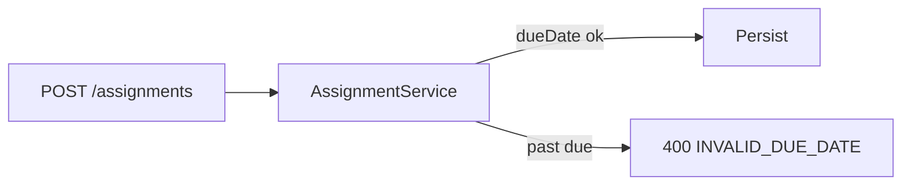

# Plan — UC-LMS-001: Teacher creates assignment

<!-- Reference example — khớp templates/plan-template.md -->

---
uc_id: UC-LMS-001
track: standard
size: S
parallel_safe: false
---

## Non-goals / Restrictions (đợt này)

| Hành vi / scope bị cấm | Lý do kỹ thuật |
|------------------------|----------------|
| Đổi response shape ngoài `201` / `400 INVALID_DUE_DATE` | Contract BDD đã khóa; breaking API ngoài UC |
| Soft-delete / archive assignment | Ngoài 3 scenario SC1–SC3 |
| Notification / email khi publish | Không nằm trong Product Brief đợt này |

## Trade-offs (Why)

| Quyết định | Chọn | Bỏ | Lý do |
|------------|------|-----|-------|
| Chỗ validate `dueDate` | Service layer trước persist | Chỉ validate ở controller | Giữ rule gần domain; tái dùng nếu thêm entrypoint |
| Status DRAFT vs PUBLISHED | Enum trên entity | Bảng status riêng | 2 giá trị — đủ cho SC1/SC2 |

## Risk Assessment

| Risk | Likelihood | Impact | Mitigation |
|------|-----------|--------|-----------|
| Quên validate past due (SC3) | Med | High | Integration test SC3 fail-first; QC smoke |
| DRAFT lộ cho student | Low | High | Test SC2 assert ẩn + filter query |

**Rollback:** Trigger error rate create-assignment bất thường → revert commit validation/endpoint · ETA < 15m

---

## Task Matrix

| Task ID | Component | Status | Verification | Code / Spec links |
|---------|-----------|--------|--------------|-------------------|
| T1 | Create PUBLISHED (SC1) | done | `npm test -- AssignmentCreate.sc1` | [UC-LMS-001.feature](../../specs/bdd/UC-LMS-001.feature) · SC1 |
| T2 | Create DRAFT (SC2) | done | `npm test -- AssignmentCreate.sc2` | [tech-design](../../specs/tech-design/UC-LMS-001-tech-design.md) |
| T3 | Reject past due (SC3) | done | `npm test -- AssignmentCreate.sc3` | [bugs.md](./bugs.md) · BUG-LMS-001 |

**Mode:** sequential — T1 → T2 → T3

---

## Task details

### T1: Tạo assignment PUBLISHED hợp lệ

- **Files:** endpoint + persist `lms_assignments`
- **Dep:** none
- **AC:**
  - [x] `201` khi payload hợp lệ, `dueDate` tương lai, `status=PUBLISHED`
  - [x] `@trace.verifies: UC-LMS-001-SC1`
- **Verify:** `npm test -- AssignmentCreate.sc1`
- **Rollback:** revert endpoint commit

### T2: Lưu nháp DRAFT

- **Files:** nhánh status DRAFT + filter ẩn student
- **Dep:** T1
- **AC:**
  - [x] `201` với `status=DRAFT`; student list không thấy
  - [x] `@trace.verifies: UC-LMS-001-SC2`
- **Verify:** `npm test -- AssignmentCreate.sc2`
- **Rollback:** revert DRAFT branch

### T3: Từ chối `dueDate` quá khứ

- **Files:** validation service trước persist
- **Dep:** T1
- **AC:**
  - [x] `400 INVALID_DUE_DATE` khi `dueDate` past
  - [x] `@trace.verifies: UC-LMS-001-SC3` (fail trước fix → pass sau)
- **Verify:** `npm test -- AssignmentCreate.sc3`
- **Rollback:** revert validation commit (không đổi schema)

---

## Pre-merge Checklist

- [x] Task Matrix: mọi Status = `done` + Verify xanh
- [x] `bash scripts/governance-check.sh` → PASS (demo)
- [x] `dev_selftest: pass` · `qc_status: pass` · `trace: pass`
- [x] Non-goals không bị vi phạm
- [x] BUG-LMS-001 Closed · QC rerun 3/3
