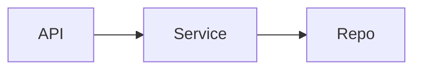

# Plan: <feature-name>

<!--
Lưu tại:        docs/work/<KEY>-<slug>/plan.md
Spec gốc:       docs/specs/modules/<module>/<spec>.md
BDD spec:       docs/specs/bdd/<UC-ID>.feature
Tech design:    docs/specs/tech-design/<UC-ID>-tech-design.md
Track:          standard | fast | hotfix
Estimated size: XS (<2h) | S (<1d) | M (<3d) | L (<1w) | XL (>1w)

Viết 1 lần khi writing-plans. Sau mỗi task: chỉ tick Status trong Task Matrix
+ [x] AC — không rewrite, không append recap. Nhật ký → note.md.
Giữ ≤ 250 dòng. Ưu tiên bảng / Mermaid ngắn; cấm prose dài.
-->

---
uc_id: <UC-ID>
track: standard
size: M
parallel_safe: true   # true nếu các task độc lập có thể chạy song song
---

## Non-goals / Restrictions (đợt này)

<!-- Việc CẤM trong scope này — ngăn dev sau đưa lại thiết kế đã bác bỏ. -->

| Hành vi / scope bị cấm | Lý do kỹ thuật |
|------------------------|----------------|
| <vd: không persist X qua Redis> | <vd: cosmetic data — giảm IO phức tạp> |
| <vd: không đổi public API contract> | <vd: breaking change ngoài UC này> |

## Trade-offs (Why)

| Quyết định | Chọn | Bỏ / không làm | Lý do |
|------------|------|----------------|-------|
| <vd: validation ở service> | A | B (controller-only) | <1 câu why> |

## Risk Assessment

| Risk | Likelihood | Impact | Mitigation |
|------|-----------|--------|-----------|
| <rủi ro kỹ thuật> | Low/Med/High | Low/Med/High | <cách giảm thiểu> |
| <rủi ro dependency> | | | |
| <rủi ro scope creep> | | | |

**Rollback:** Trigger `<điều kiện>` → Action `<flag off / revert>` → Cmd `` `<lệnh>` `` · ETA `<thời gian>`

---

## Task Matrix (source of progress)

<!-- Bảng này = tiến độ chính. Status: pending | in_progress | done.
     Verification: lệnh copy-run được (bắt buộc). Path: relative link. -->

| Task ID | Component | Status | Verification | Code / Spec links |
|---------|-----------|--------|--------------|-------------------|
| T1 | `<component>` | pending | `` `<lệnh test/build>` `` | [`path`](../../..) · [spec §](../specs/...) |
| T2 | `<component>` | pending | `` `<lệnh>` `` | [`path`](../../..) |
| T3 | `<component>` | pending | `` `<lệnh>` `` | [`path`](../../..) |

**Mode:** sequential | parallel | mixed

```
Dependency (mixed only):
  T1 ──→ T3
  T2 ──→ T3 ──→ T5
  T4 ──────────→ T5
```

<!-- Mermaid ngắn thay 3–4 đoạn văn mô tả luồng (optional):

-->

---

## Task details (slim)

<!-- Mỗi task ≤ 6 dòng. Không kể chuyện. AC đo được. -->

### T1: <động từ + danh từ>

- **Files:** [`src/...`](../../src/...) · [`test/...`](../../test/...)
- **Dep:** none | T<n>
- **AC:**
  - [ ] <tiêu chí đo được>
  - [ ] <tiêu chí đo được>
- **Verify:** `` `<lệnh — trùng cột Verification>` ``
- **Rollback:** <revert file / drop migration / flag off>

### T2: <tên>

- **Files:**
- **Dep:**
- **AC:**
  - [ ]
- **Verify:** `` `<lệnh>` ``
- **Rollback:**

### Sync checkpoint (mixed only)

- [ ] T1 + T2 pass verification
- [ ] Build tổng sạch · không regression

### T3: <integration / wiring>

- **Files:**
- **Dep:** T1, T2
- **AC:**
  - [ ]
- **Verify:** `` `<lệnh>` ``
- **Rollback:**

---

## Pre-merge Checklist

- [ ] Task Matrix: mọi Status = `done` + Verify cmd đã chạy xanh
- [ ] `bash scripts/governance-check.sh` → PASS
- [ ] `dev_selftest: pass` trong `_context.md` state (+ trace TSV nếu có)
- [ ] Không TODO/FIXME mới chưa resolve
- [ ] Non-goals không bị vi phạm trong diff
- [ ] Rollback plan đã test (staging) nếu risk Med/High
